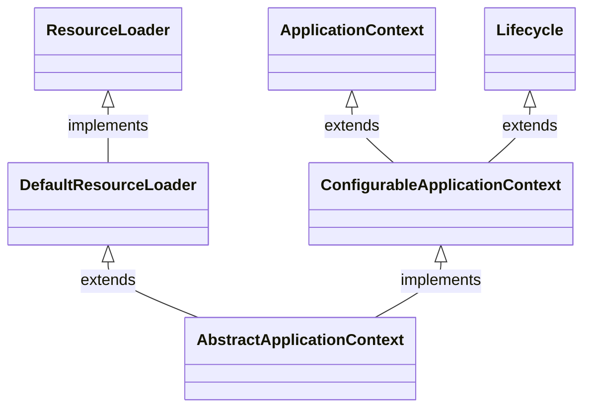
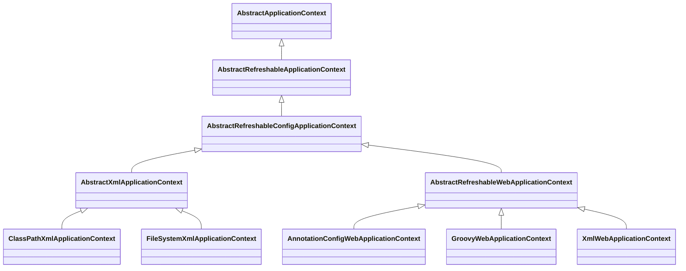
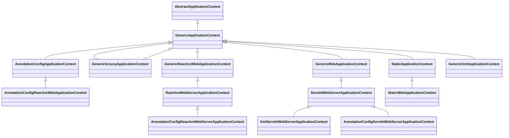

# AbstractApplicationContext

# 1 继承关系
## 1.1 父类

## 1.2 AbstractRefreshableApplicationContext

## 1.3 GenericApplicationContext



# 2. refresh
```
    @Override
	public void refresh() throws BeansException, IllegalStateException {
		this.startupShutdownLock.lock();
		try {
			this.startupShutdownThread = Thread.currentThread();

			StartupStep contextRefresh = this.applicationStartup.start("spring.context.refresh");

			// Prepare this context for refreshing.
			prepareRefresh();

			// Tell the subclass to refresh the internal bean factory.
			ConfigurableListableBeanFactory beanFactory = obtainFreshBeanFactory();

			// Prepare the bean factory for use in this context.
			prepareBeanFactory(beanFactory);

			try {
				// Allows post-processing of the bean factory in context subclasses.
				postProcessBeanFactory(beanFactory);

				StartupStep beanPostProcess = this.applicationStartup.start("spring.context.beans.post-process");
				// Invoke factory processors registered as beans in the context.
				invokeBeanFactoryPostProcessors(beanFactory);
				// Register bean processors that intercept bean creation.
				registerBeanPostProcessors(beanFactory);
				beanPostProcess.end();

				// Initialize message source for this context.
				initMessageSource();

				// Initialize event multicaster for this context.
				initApplicationEventMulticaster();

				// Initialize other special beans in specific context subclasses.
				onRefresh();

				// Check for listener beans and register them.
				registerListeners();

				// Instantiate all remaining (non-lazy-init) singletons.
				finishBeanFactoryInitialization(beanFactory);

				// Last step: publish corresponding event.
				finishRefresh();
			}

			catch (RuntimeException | Error ex) {
				if (logger.isWarnEnabled()) {
					logger.warn("Exception encountered during context initialization - " +
							"cancelling refresh attempt: " + ex);
				}

				// Destroy already created singletons to avoid dangling resources.
				destroyBeans();

				// Reset 'active' flag.
				cancelRefresh(ex);

				// Propagate exception to caller.
				throw ex;
			}

			finally {
				contextRefresh.end();
			}
		}
		finally {
			this.startupShutdownThread = null;
			this.startupShutdownLock.unlock();
		}
	}
```

## 2.1. 准备阶段：环境与状态初始化 (prepareRefresh)
这是刷新前的准备工作：

记录启动时间：标记容器启动的时间点。

设置状态标志：将容器的 active 状态设为 true，closed 设为 false。

初始化属性源：调用 initPropertySources()，为子类（如Web环境）提供初始化特定PropertySource的扩展点。

验证必填属性：检查Environment中必须存在的属性，确保关键配置已就绪。

管理早期监听器：保存刷新前的监听器，以便在刷新完成后恢复。
### 2.1.1 initPropertySources
```
	protected void initPropertySources() {
		// For subclasses: do nothing by default.
	}
// AbstractRefreshableWebApplicationContext.java
@Override
	protected void initPropertySources() {
		ConfigurableEnvironment env = getEnvironment();
		if (env instanceof ConfigurableWebEnvironment configurableWebEnv) {
			configurableWebEnv.initPropertySources(this.servletContext, this.servletConfig);
		}
	}

```
### 2.1.2 createEnvironment 创建环境,根据不同的ctx创建环境
```
//AbstractApplicationContext.java
protected ConfigurableEnvironment createEnvironment() {
		return new StandardEnvironment();
}
// AbstractRefreshableWebApplicationContext.java
@Override
protected ConfigurableEnvironment createEnvironment() {
		return new StandardServletEnvironment();
}
// GenericReactiveWebApplicationContext.java

@Override
protected ConfigurableEnvironment createEnvironment() {
		return new StandardReactiveWebEnvironment();
}
// GenericWebApplicationContext.java
@Override
	protected ConfigurableEnvironment createEnvironment() {
		return new StandardServletEnvironment();
	}
// StaticWebApplicationContext.java
	@Override
	protected ConfigurableEnvironment createEnvironment() {
		return new StandardServletEnvironment();
	}
```


## 2.2. 创建/获取 BeanFactory (obtainFreshBeanFactory)
这一步是获取或刷新底层的 BeanFactory 实例。

它会销毁并关闭已有的 BeanFactory（如果存在）。

然后创建一个新的 BeanFactory，并负责加载和解析所有配置的 Bean 定义（BeanDefinition），这些定义是后续创建 Bean 的“蓝图”。
### 2.2.1 refreshBeanFactory 销毁并关闭已有的 BeanFactory
```
protected final void refreshBeanFactory() throws BeansException {
		if (hasBeanFactory()) {
			destroyBeans();
			closeBeanFactory();
		}
		try {
            // 创建一个全新的BeanFactory
			DefaultListableBeanFactory beanFactory = createBeanFactory();
			beanFactory.setSerializationId(getId());
			beanFactory.setApplicationStartup(getApplicationStartup());
            // 子类自定义
			customizeBeanFactory(beanFactory);
            // 载入bean定义
			loadBeanDefinitions(beanFactory);
			this.beanFactory = beanFactory;
		}
		catch (IOException ex) {
			...
		}
	}
```

## 2.3. 配置 BeanFactory (prepareBeanFactory)
对新获取的 BeanFactory 进行标准配置，使其具备Spring容器的基本能力：

设置类加载器：用于加载类。

配置表达式语言支持：例如，添加 StandardBeanExpressionResolver 以支持 SpEL。

添加属性编辑器：如 ResourceEditorRegistrar，用于处理属性值的类型转换。

注册可解析的依赖：将 BeanFactory、ApplicationContext 等自身组件注册为可注入的依赖。

添加默认的 BeanPostProcessor：添加 ApplicationContextAwareProcessor 和 ApplicationListenerDetector，用于处理特定的Aware接口和事件监听器。

添加默认的bean:
- environment
- systemProperties
- systemEnvironment
- applicationStartup

beanFactory 的 singletonObjects 有这4个值
```
protected void prepareBeanFactory(ConfigurableListableBeanFactory beanFactory) {
		// Tell the internal bean factory to use the context's class loader etc.
		beanFactory.setBeanClassLoader(getClassLoader());
		beanFactory.setBeanExpressionResolver(new StandardBeanExpressionResolver(beanFactory.getBeanClassLoader()));
		beanFactory.addPropertyEditorRegistrar(new ResourceEditorRegistrar(this, getEnvironment()));

		// Configure the bean factory with context callbacks.
		beanFactory.addBeanPostProcessor(new ApplicationContextAwareProcessor(this));
		beanFactory.ignoreDependencyInterface(EnvironmentAware.class);
		beanFactory.ignoreDependencyInterface(EmbeddedValueResolverAware.class);
		beanFactory.ignoreDependencyInterface(ResourceLoaderAware.class);
		beanFactory.ignoreDependencyInterface(ApplicationEventPublisherAware.class);
		beanFactory.ignoreDependencyInterface(MessageSourceAware.class);
		beanFactory.ignoreDependencyInterface(ApplicationContextAware.class);
		beanFactory.ignoreDependencyInterface(ApplicationStartupAware.class);

		// BeanFactory interface not registered as resolvable type in a plain factory.
		// MessageSource registered (and found for autowiring) as a bean.
		beanFactory.registerResolvableDependency(BeanFactory.class, beanFactory);
		beanFactory.registerResolvableDependency(ResourceLoader.class, this);
		beanFactory.registerResolvableDependency(ApplicationEventPublisher.class, this);
		beanFactory.registerResolvableDependency(ApplicationContext.class, this);

		// Register early post-processor for detecting inner beans as ApplicationListeners.
		beanFactory.addBeanPostProcessor(new ApplicationListenerDetector(this));

		// Detect a LoadTimeWeaver and prepare for weaving, if found.
		if (!NativeDetector.inNativeImage() && beanFactory.containsBean(LOAD_TIME_WEAVER_BEAN_NAME)) {
			beanFactory.addBeanPostProcessor(new LoadTimeWeaverAwareProcessor(beanFactory));
			// Set a temporary ClassLoader for type matching.
			beanFactory.setTempClassLoader(new ContextTypeMatchClassLoader(beanFactory.getBeanClassLoader()));
		}

		// Register default environment beans.
		if (!beanFactory.containsLocalBean(ENVIRONMENT_BEAN_NAME)) {
			beanFactory.registerSingleton(ENVIRONMENT_BEAN_NAME, getEnvironment());
		}
		if (!beanFactory.containsLocalBean(SYSTEM_PROPERTIES_BEAN_NAME)) {
			beanFactory.registerSingleton(SYSTEM_PROPERTIES_BEAN_NAME, getEnvironment().getSystemProperties());
		}
		if (!beanFactory.containsLocalBean(SYSTEM_ENVIRONMENT_BEAN_NAME)) {
			beanFactory.registerSingleton(SYSTEM_ENVIRONMENT_BEAN_NAME, getEnvironment().getSystemEnvironment());
		}
		if (!beanFactory.containsLocalBean(APPLICATION_STARTUP_BEAN_NAME)) {
			beanFactory.registerSingleton(APPLICATION_STARTUP_BEAN_NAME, getApplicationStartup());
		}
	}

```


## 2.4. 子类扩展点 (postProcessBeanFactory)
这是一个空实现的模板方法，允许子类在 BeanFactory 完成标准配置后，进行自定义的后置处理。

例如，在 Web 环境中，AnnotationConfigServletWebServerApplicationContext 会在此处注册 request、session 等 Web 作用域。

## 2.5. 调用 BeanFactory 后处理器 (invokeBeanFactoryPostProcessors)
这是Spring提供的一个强大扩展点，用于在 Bean 实例化之前，对 BeanFactory 本身进行定制。

它会执行所有已注册的 BeanFactoryPostProcessor。

典型的实现如 ConfigurationClassPostProcessor，用于解析 @Configuration、@Bean 等注解，从而生成更多的 BeanDefinition。


## 2.6. 注册 Bean 后处理器 (registerBeanPostProcessors)
这一步从 BeanFactory 中找出所有实现了 BeanPostProcessor 接口的 Bean，并将它们注册到容器中。

BeanPostProcessor 是另一个核心扩展点，它会在 Bean 的实例化、初始化等生命周期阶段进行干预。

常见的包括处理 @Autowired 的 AutowiredAnnotationBeanPostProcessor 和用于 AOP 的 AnnotationAwareAspectJAutoProxyCreator。

## 2.7. 初始化国际化
initMessageSource()：初始化消息源，用于支持国际化（i18n）功能。
效果： 注册 name = messageSource 的bean,value = DelegatingMessageSource

## 2.8. 初始化事件广播器
initApplicationEventMulticaster()：初始化事件广播器，用于管理Spring的事件机制。
效果： 注册 name = applicationEventMulticaster的bean ,value = SimpleApplicationEventMulticaster

## 2.9. 子类扩展钩子 (onRefresh)
这是另一个模板方法，同样为空实现，供子类在特定时机执行额外的初始化逻辑。

最典型的应用是 Spring Boot 的内嵌 Web 容器（如 Tomcat）就是在此处启动的。

## 2.10. 注册事件监听器 (registerListeners)
将容器中所有实现了 ApplicationListener 接口的 Bean 注册到第8步初始化的事件广播器中。

## 2.11. 实例化单例 Bean (finishBeanFactoryInitialization)
这是最重量级的一步，负责实例化所有非懒加载的单例 Bean。

它会根据 BeanDefinition 进行依赖注入、初始化等操作，完成整个 IoC 容器的核心工作。
### 2.11.1 beanFactory.prepareSingletonBootstrap
### 2.11.2 beanFactory.setBootstrapExecutor
如果容器中有 bootstrapExecutor 的bean ,并且类型为 Executor
则将beanFactory 的 BootstrapExecutor 设置为 bootstrapExecutor
### 2.11.3 beanFactory.setConversionService
如果容器中有conversionService 的bean ，并且类型为ConversionService
则beanFactory.setConversionService
### 2.11.4 初始化 BeanFactoryInitializer类型的bean
并且调用方法initialize()
### 2.11.5 初始化 LoadTimeWeaverAware 类型的bean

### 2.11.6 beanFactory.setTempClassLoader(null)
### 2.11.7 beanFactory.freezeConfiguration();
### 2.11.8 beanFactory.preInstantiateSingletons() 正式的实例化每个bean
实例化bean的入口
```

DefaultListableBeanFactory.java

private void instantiateSingleton(String beanName) {
		if (isFactoryBean(beanName)) {
			Object bean = getBean(FACTORY_BEAN_PREFIX + beanName);
			if (bean instanceof SmartFactoryBean<?> smartFactoryBean && smartFactoryBean.isEagerInit()) {
				getBean(beanName);
			}
		}
		else {
			getBean(beanName); // 大部分业务bean都是这里创建的
		}
	}

```


## 2.12. 完成刷新 (finishRefresh)
容器的最后收尾工作：

清除资源缓存。

初始化生命周期处理器（LifecycleProcessor）并调用其 onRefresh() 方法。

发布 ContextRefreshedEvent 事件，通知所有监听器容器已刷新完成。

```
protected void finishRefresh() {
		// Reset common introspection caches in Spring's core infrastructure.
		resetCommonCaches();

		// Clear context-level resource caches (such as ASM metadata from scanning).
		clearResourceCaches();

		// Initialize lifecycle processor for this context.
		initLifecycleProcessor();

		// Propagate refresh to lifecycle processor first.
		getLifecycleProcessor().onRefresh();

		// Publish the final event.
		publishEvent(new ContextRefreshedEvent(this));
	}
```