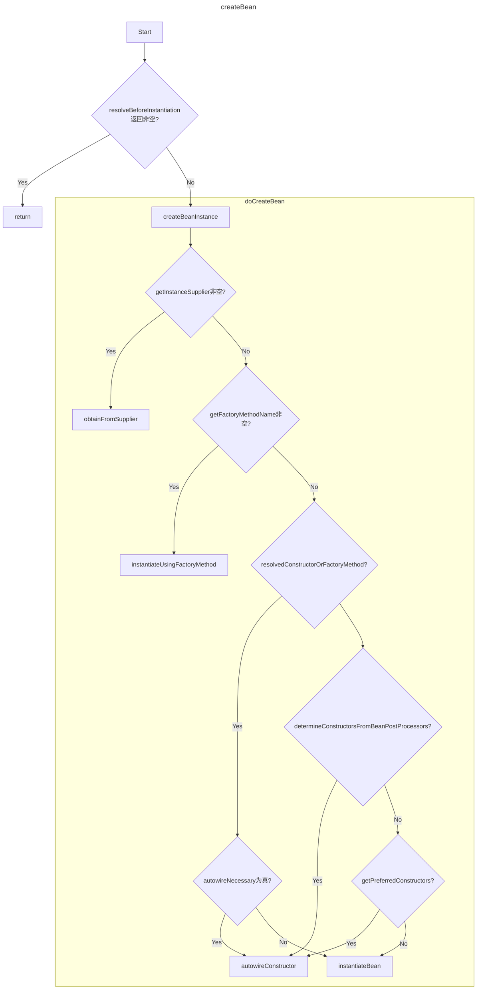
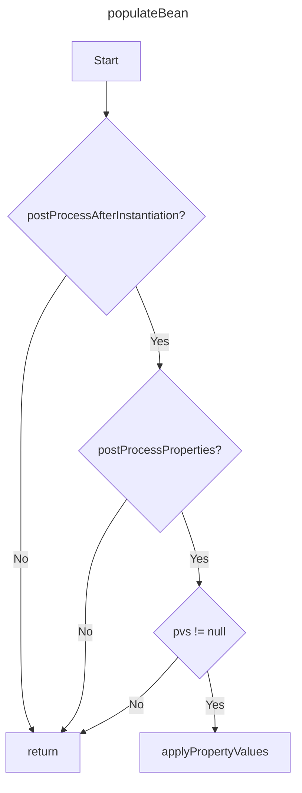

# AbstractAutowireCapableBeanFactory 

```createBean``` 是创建 bean的入口函数，来自```AbstractBeanFactory.doGetBean```调用

几个关键步骤

- createBean:入口函数
- resolveBeforeInstantiation：它允许在 Spring 执行默认的实例化流程之前，通过特定的后置处理器（InstantiationAwareBeanPostProcessor）直接返回一个对象，从而完全跳过后续复杂的实例化、属性填充和初始化过程
- doCreateBean
- createBeanInstance：创建bean，此刻还没有属性，构造函数注入的属性除外
- determineCandidateConstructors:回调 SmartInstantiationAwareBeanPostProcessor获得构造函数
- applyMergedBeanDefinitionPostProcessors：回调 MergedBeanDefinitionPostProcessor接口
- addSingletonFactory/singletonFactories
- populateBean：填充属性


几个重要的回调接口：
InstantiationAwareBeanPostProcessor



