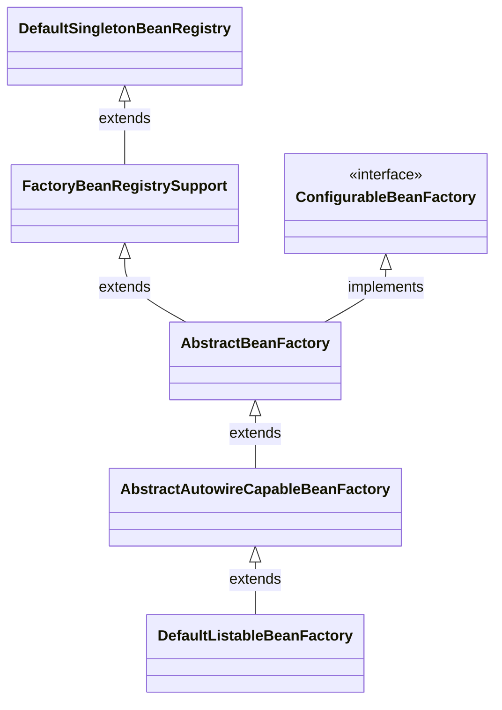

# AbstractBeanFactory

# 1. 继承关系

AbstractBeanFactory 是 Spring IoC 容器体系中一个极其关键且承上启下的骨架实现类
它在整个继承链中处于中层：实现了 ConfigurableBeanFactory 接口，并继承自 FactoryBeanRegistrySupport（后者又继承 DefaultSingletonBeanRegistry）。它并不负责“如何创建 Bean”的具体细节（那是子类 AbstractAutowireCapableBeanFactory 的事），而是专注于定义“获取 Bean”的统一流程和提供公共的基础设施

其中最大的能力的是提供 getBean(...)创建bean

# 2. getBean

## 2.1 转换 name,将前置的&移除 

```
String beanName = transformedBeanName(name);

protected String transformedBeanName(String name) {
		return canonicalName(BeanFactoryUtils.transformedBeanName(name));
	}
    // BeanFactoryUtils.java
    public static String transformedBeanName(String name) {
		Assert.notNull(name, "'name' must not be null");
		if (name.isEmpty() || name.charAt(0) != BeanFactory.FACTORY_BEAN_PREFIX_CHAR) {
			return name;
		}
		return transformedBeanNameCache.computeIfAbsent(name, beanName -> {
			do {
				beanName = beanName.substring(1);  // length of '&'
			}
			while (beanName.charAt(0) == BeanFactory.FACTORY_BEAN_PREFIX_CHAR);
			return beanName;
		});
	}

```