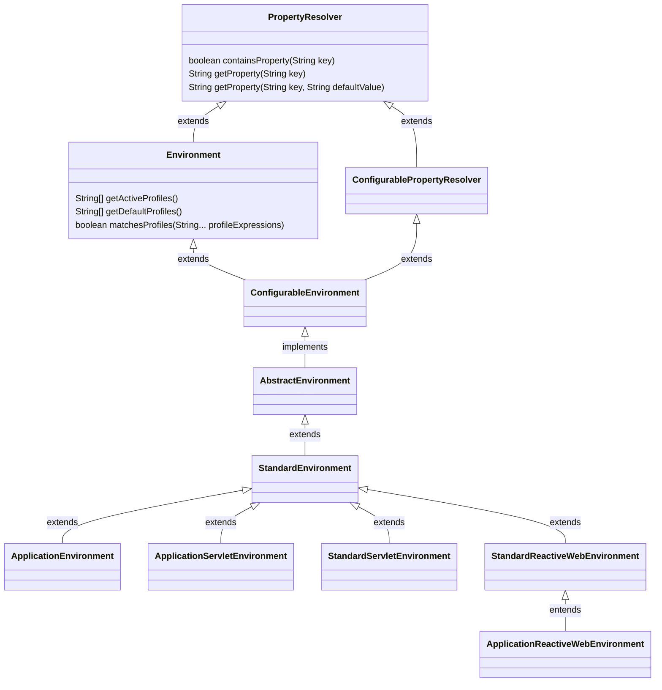

# AbstractEnvironment
# 0.Environment是什么？
表示当前应用程序运行环境的接口。它建模了应用程序环境中的两个关键方面：配置文件（profiles）和属性（properties）。与属性访问相关的方法通过 `PropertyResolver` 超接口暴露出来。

配置文件是一个命名的、逻辑上的 Bean 定义组，只有在给定的配置文件处于活动状态时，这些 Bean 定义才会被注册到容器中。无论 Bean 是通过 XML 定义还是通过注解定义，都可以将其分配给某个配置文件；有关语法细节，请参阅 spring-beans 3.1 模式或 `@Profile` 注解。`Environment` 对象在配置文件方面的作用是确定当前哪些配置文件（如果有的话）处于活动状态，以及默认情况下哪些配置文件（如果有的话）应该处于活动状态。

属性在几乎所有应用程序中都扮演着重要角色，并且可能来源于各种不同的来源：属性文件、JVM 系统属性、系统环境变量、JNDI、Servlet 上下文参数、临时的 `Properties` 对象、`Map` 等等。`Environment` 对象在属性方面的作用是为用户提供一种便捷的服务接口，用于配置属性源并从中解析属性。

在 `ApplicationContext` 中管理的 Bean 可以注册为 `org.springframework.context.EnvironmentAware` 或者通过 `@Inject` 注解注入 `Environment`，以便直接查询配置文件状态或解析属性。

然而在大多数情况下，应用程序级别的 Bean 不需要直接与 `Environment` 交互，而是可以请求通过属性占位符配置器（如 `PropertySourcesPlaceholderConfigurer`）来替换 `${...}` 占位符，该配置器本身是 `EnvironmentAware` 的，并且在使用 `<context:property-placeholder/>` 时默认会被注册。

`Environment` 对象的配置必须通过 `ConfigurableEnvironment` 接口来完成，该接口由所有 `AbstractApplicationContext` 子类的 `getEnvironment()` 方法返回。有关使用示例，请参阅 `ConfigurableEnvironment` 的 Javadoc，其中展示了在刷新应用程序上下文（`refresh()`）之前如何操作属性源。

# 1. 继承关系


## 2.StandardEnvironment
AbstractApplicationContext 默认创建的环境就是 StandardEnvironment
ClassPathXmlApplicationContext 也是使用的该

通过定义抽象方法来进行拓展

```
	protected void customizePropertySources(MutablePropertySources propertySources) {
	}

    // StandardEnvironment.java
    @Override
	protected void customizePropertySources(MutablePropertySources propertySources) {
		propertySources.addLast(
				new PropertiesPropertySource(SYSTEM_PROPERTIES_PROPERTY_SOURCE_NAME, getSystemProperties()));
		propertySources.addLast(
				new SystemEnvironmentPropertySource(SYSTEM_ENVIRONMENT_PROPERTY_SOURCE_NAME, getSystemEnvironment()));
	}

```
StandardEnvironment 默认添加的环境变量(Environment)

```
# systemProperties
public Map<String, Object> getSystemProperties() {
    // 通过 java -D 指定 
	return (Map) System.getProperties();
}

# systemEnvironment
public Map<String, Object> getSystemEnvironment() {
	if (suppressGetenvAccess()) {
		return Collections.emptyMap();
	}
    // 通过环境变量传入
	return (Map) System.getenv();
}
```
