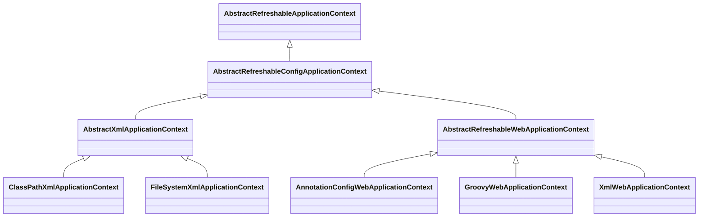

# AbstractRefreshableConfigApplicationContext

```mermaid
classDiagram
    AbstractRefreshableApplicationContext <|-- AbstractRefreshableConfigApplicationContext
    AbstractRefreshableConfigApplicationContext <|-- AbstractXmlApplicationContext
    AbstractRefreshableConfigApplicationContext <|-- AbstractRefreshableWebApplicationContext
    AbstractXmlApplicationContext <|-- ClassPathXmlApplicationContext
    AbstractXmlApplicationContext <|-- FileSystemXmlApplicationContext
    AbstractRefreshableWebApplicationContext <|-- AnnotationConfigWebApplicationContext
    AbstractRefreshableWebApplicationContext <|-- GroovyWebApplicationContext
    AbstractRefreshableWebApplicationContext <|-- XmlWebApplicationContext
```