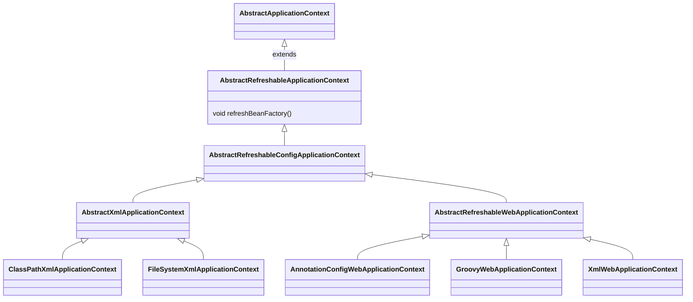

# AbstractRefreshableConfigApplicationContext
# 1.继承关系


# 2.AbstractRefreshableConfigApplicationContext作用是什么?
承上启下，有用的就这一个函数:

此实现会实际刷新此上下文底层 BeanFactory，关闭之前的 BeanFactory（如果有），并为此上下文生命周期的下一阶段初始化一个新的 BeanFactory。

该方法会在父类[AbstractApplicationContext](./AbstractApplicationContext.md) 中refresh中第2步骤obtainFreshBeanFactory中调用
```
@Override
	protected final void refreshBeanFactory() throws BeansException {
		if (hasBeanFactory()) {
			destroyBeans();
			closeBeanFactory();
		}
		try {
			DefaultListableBeanFactory beanFactory = createBeanFactory();
			beanFactory.setSerializationId(getId());
			beanFactory.setApplicationStartup(getApplicationStartup());
			customizeBeanFactory(beanFactory);
			loadBeanDefinitions(beanFactory);
			this.beanFactory = beanFactory;
		}
		catch (IOException ex) {
			throw new ApplicationContextException("I/O error parsing bean definition source for " + getDisplayName(), ex);
		}
	}

// 创建默认的beanFactory DefaultListableBeanFactory
protected DefaultListableBeanFactory createBeanFactory() {
		return new DefaultListableBeanFactory(getInternalParentBeanFactory());
	}
```