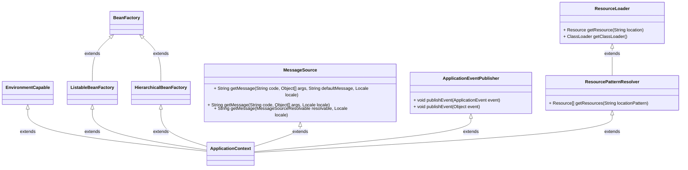

# ApplicationContext

## 1.继承关系

```mermaid
classDiagram
    EnvironmentCapable <|-- ApplicationContext:extends
    ListableBeanFactory <|-- ApplicationContext:extends
    HierarchicalBeanFactory <|-- ApplicationContext:extends
    MessageSource <|-- ApplicationContext:extends
    ApplicationEventPublisher <|-- ApplicationContext:extends
    ResourcePatternResolver <|-- ApplicationContext:extends

    BeanFactory <|-- ListableBeanFactory:extends
    BeanFactory <|-- HierarchicalBeanFactory:extends
    ResourceLoader <|-- ResourcePatternResolver:extends


class ResourceLoader {
    + Resource getResource(String location)
    + ClassLoader getClassLoader()

}
class ResourcePatternResolver {
    + Resource[] getResources(String locationPattern)
}
class ApplicationEventPublisher {
    + void publishEvent(ApplicationEvent event)
    + void publishEvent(Object event)
}
class MessageSource {
    + String getMessage(String code, Object[] args, String defaultMessage, Locale locale)
    + String getMessage(String code, Object[] args, Locale locale)
    + String getMessage(MessageSourceResolvable resolvable, Locale locale)
}

```