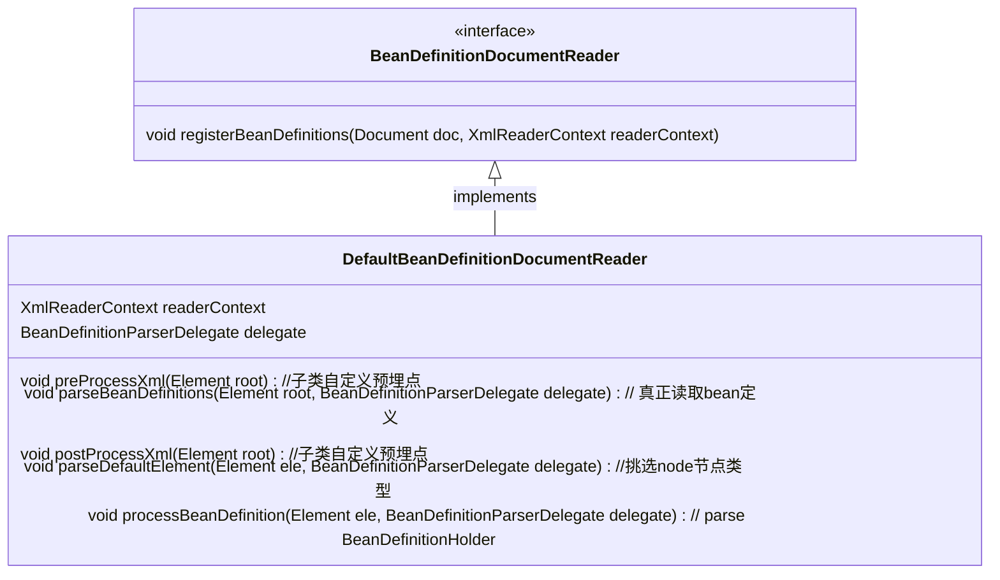
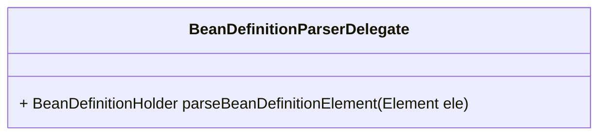
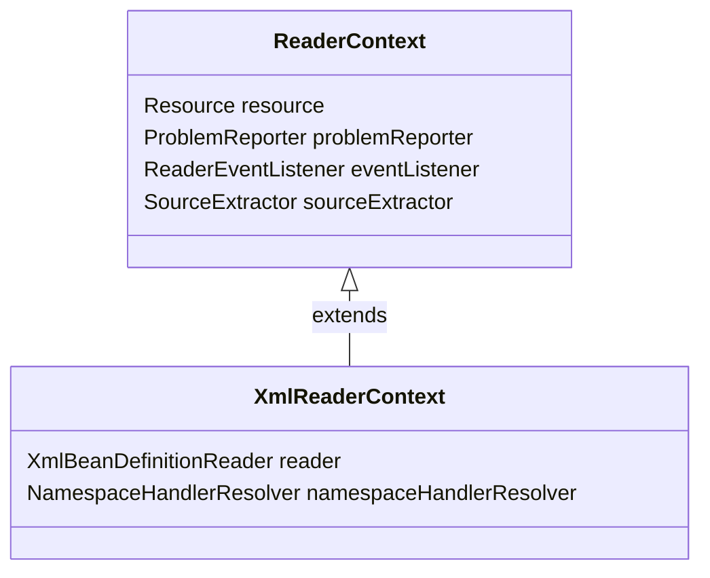

# BeanDefinitionDocumentReader

用于解析包含Spring bean定义的XML文档 由XmlBeanDefinitionReader用于实际解析DOM文档

example:

```java
// XmlBeanDefinitionReader.java
	public int registerBeanDefinitions(Document doc, Resource resource) throws BeanDefinitionStoreException {
		BeanDefinitionDocumentReader documentReader = createBeanDefinitionDocumentReader();
		int countBefore = getRegistry().getBeanDefinitionCount();
		documentReader.registerBeanDefinitions(doc, createReaderContext(resource));
		return getRegistry().getBeanDefinitionCount() - countBefore;
	}
```


实际parse BeanDefinitionHolder依赖BeanDefinitionParserDelegate.java



