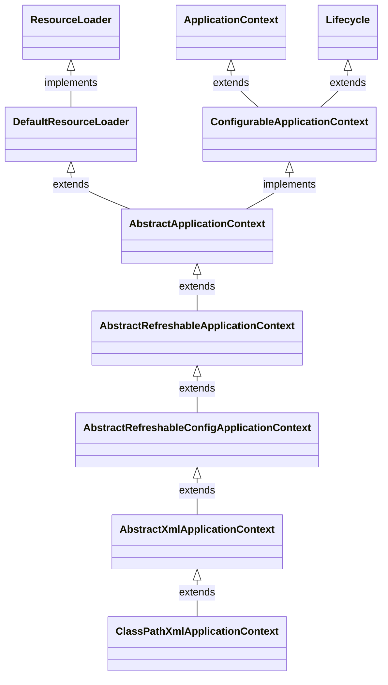

# ClassPathXmlApplicationContext

## 1.继承关系图

```mermaid
classDiagram
    ApplicationContext <|-- ConfigurableApplicationContext:extends
    Lifecycle <|-- ConfigurableApplicationContext:extends
    ResourceLoader <|-- DefaultResourceLoader:implements
    DefaultResourceLoader <|-- AbstractApplicationContext:extends
    ConfigurableApplicationContext <|-- AbstractApplicationContext:implements
    AbstractApplicationContext <|--AbstractRefreshableApplicationContext:extends
    AbstractRefreshableApplicationContext <|-- AbstractRefreshableConfigApplicationContext:extends
    AbstractRefreshableConfigApplicationContext <|-- AbstractXmlApplicationContext:extends
    AbstractXmlApplicationContext <|-- ClassPathXmlApplicationContext:extends
```

## 2. refresh

## 2.1 是如何加载bean定义的
```
    // AbstractXmlApplicationContext.java
	@Override
	protected void loadBeanDefinitions(DefaultListableBeanFactory beanFactory) throws BeansException, IOException {
		// Create a new XmlBeanDefinitionReader for the given BeanFactory.
		XmlBeanDefinitionReader beanDefinitionReader = new XmlBeanDefinitionReader(beanFactory);

		// Configure the bean definition reader with this context's
		// resource loading environment.
		beanDefinitionReader.setEnvironment(getEnvironment());
		beanDefinitionReader.setResourceLoader(this);
		beanDefinitionReader.setEntityResolver(new ResourceEntityResolver(this));

		// Allow a subclass to provide custom initialization of the reader,
		// then proceed with actually loading the bean definitions.
		initBeanDefinitionReader(beanDefinitionReader);
		loadBeanDefinitions(beanDefinitionReader);//函数入口
	}

    AbstractBeanDefinitionReader.java
    @Override
	public int loadBeanDefinitions(String... locations) throws BeanDefinitionStoreException {
		Assert.notNull(locations, "Location array must not be null");
		int count = 0;
		for (String location : locations) {
			count += loadBeanDefinitions(location);
		}
		return count;
	}

    public int loadBeanDefinitions(String location, @Nullable Set<Resource> actualResources) throws BeanDefinitionStoreException {
        ...
    }
    //XmlBeanDefinitionReader.java
    public int loadBeanDefinitions(EncodedResource encodedResource) throws BeanDefinitionStoreException {
        
    }
    protected int doLoadBeanDefinitions(InputSource inputSource, Resource resource){
        try {
			Document doc = doLoadDocument(inputSource, resource);
			int count = registerBeanDefinitions(doc, resource);
			if (logger.isDebugEnabled()) {
				logger.debug("Loaded " + count + " bean definitions from " + resource);
			}
			return count;
		}...
    }
    public int registerBeanDefinitions(Document doc, Resource resource) throws BeanDefinitionStoreException {
		BeanDefinitionDocumentReader documentReader = createBeanDefinitionDocumentReader();
		int countBefore = getRegistry().getBeanDefinitionCount();
		documentReader.registerBeanDefinitions(doc, createReaderContext(resource));
		return getRegistry().getBeanDefinitionCount() - countBefore;
	}

    //DefaultBeanDefinitionDocumentReader.java
    @Override
	public void registerBeanDefinitions(Document doc, XmlReaderContext readerContext) {
		this.readerContext = readerContext;
		doRegisterBeanDefinitions(doc.getDocumentElement());
	}
    protected void doRegisterBeanDefinitions(Element root) {
		...
		preProcessXml(root);
		parseBeanDefinitions(root, current); // 读取bean定义入口
		postProcessXml(root);

		this.delegate = parent;
	}
    ... 最后在processBeanDefinition中注册bean definition

    protected void processBeanDefinition(Element ele, BeanDefinitionParserDelegate delegate) {
		BeanDefinitionHolder bdHolder = delegate.parseBeanDefinitionElement(ele);
		if (bdHolder != null) {
			bdHolder = delegate.decorateBeanDefinitionIfRequired(ele, bdHolder);
			try {
				// Register the final decorated instance.
				BeanDefinitionReaderUtils.registerBeanDefinition(bdHolder, getReaderContext().getRegistry());
			}
			catch (BeanDefinitionStoreException ex) {
				getReaderContext().error("Failed to register bean definition with name '" +
						bdHolder.getBeanName() + "'", ele, ex);
			}
			// Send registration event.
			getReaderContext().fireComponentRegistered(new BeanComponentDefinition(bdHolder));
		}
	}

```

### 2.1.1 如何读取xml中的bean节点的
```xml
<?xml version="1.0" encoding="UTF-8"?>
<beans xmlns="http://www.springframework.org/schema/beans"
       xmlns:xsi="http://www.w3.org/2001/XMLSchema-instance"
       xsi:schemaLocation="http://www.springframework.org/schema/beans
		https://www.springframework.org/schema/beans/spring-beans.xsd">

    <bean id="petStore" class="cc.alking.example.springboot.beans.PetStore">
    </bean>
</beans>


    //DefaultBeanDefinitionDocumentReader.java
    private void parseDefaultElement(Element ele, BeanDefinitionParserDelegate delegate) {
		if (delegate.nodeNameEquals(ele, IMPORT_ELEMENT)) {
			importBeanDefinitionResource(ele);
		}
		else if (delegate.nodeNameEquals(ele, ALIAS_ELEMENT)) {
			processAliasRegistration(ele);
		}
		else if (delegate.nodeNameEquals(ele, BEAN_ELEMENT)) {
			processBeanDefinition(ele, delegate);// bean
		}
		else if (delegate.nodeNameEquals(ele, NESTED_BEANS_ELEMENT)) {
			// recurse
			doRegisterBeanDefinitions(ele);
		}
	}
    public BeanDefinitionHolder parseBeanDefinitionElement(Element ele, @Nullable BeanDefinition containingBean) {
    ...
    AbstractBeanDefinition beanDefinition = parseBeanDefinitionElement(ele, beanName, containingBean);
    ...
    return new BeanDefinitionHolder(beanDefinition, beanName, aliasesArray);
    }
```
 依赖 DefaultBeanDefinitionDocumentReader的读取(parse)与注册(registry)

## 2.2 bean 是如何初始化的
调用栈如下
```
AbstractApplicationContext.java
refresh()
finishBeanFactoryInitialization(ConfigurableListableBeanFactory beanFactory)
beanFactory.preInstantiateSingletons();


DefaultListableBeanFactory.java
preInstantiateSingletons()
instantiateSingleton()

AbstractBeanFactory.java
getBean()


```