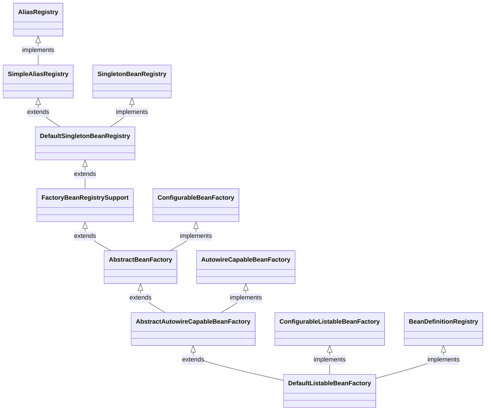
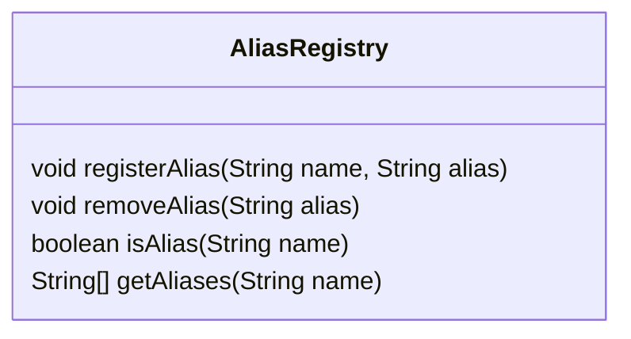
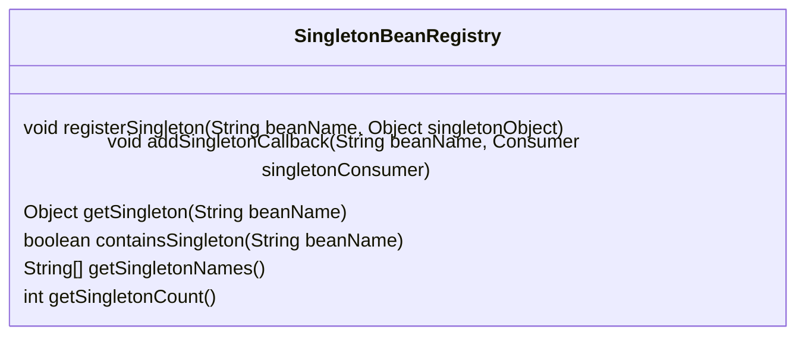
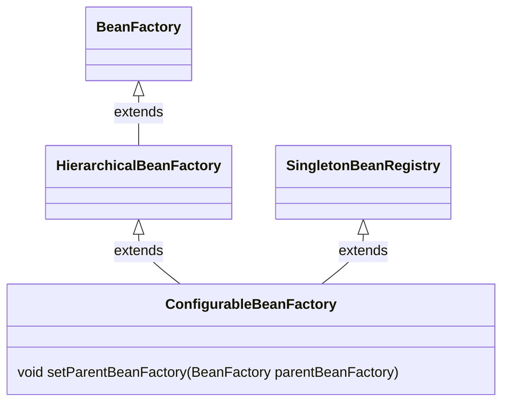
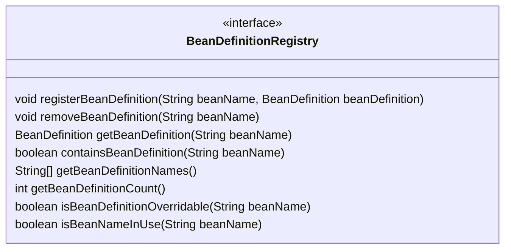

# DefaultListableBeanFactory

# 1.继承关系

## 1.1 AliasRegistry(interface)
简单的来说就是一个别名(alias)的管理

## 1.2 SingletonBeanRegistry(interface)
定义共享bean实例注册表的接口。org.springframework.beans.factory.BeanFactory的实现类可以实现此接口，以便以统一方式暴露其单例管理功能。
就是一个单例的增删改查器

## 1.3 ConfigurableBeanFactory(interface)

## 1.4 BeanDefinitionRegistry
