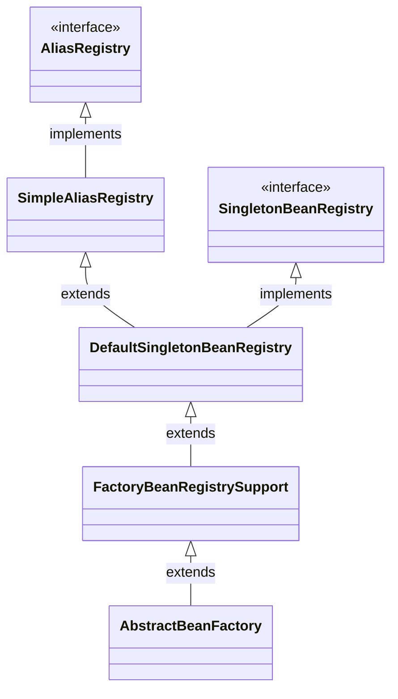

# DefaultSingletonBeanRegistry

# 1. 继承关系

```mermaid
classDiagram

    SimpleAliasRegistry <|-- DefaultSingletonBeanRegistry:extends
    SingletonBeanRegistry <|-- DefaultSingletonBeanRegistry:implements
    AliasRegistry <|-- SimpleAliasRegistry:implements
    DefaultSingletonBeanRegistry <|-- FactoryBeanRegistrySupport:extends
    FactoryBeanRegistrySupport <|-- AbstractBeanFactory:extends

    class SingletonBeanRegistry {
        <<interface>>
    }
    class AliasRegistry {
        <<interface>>
    }

```