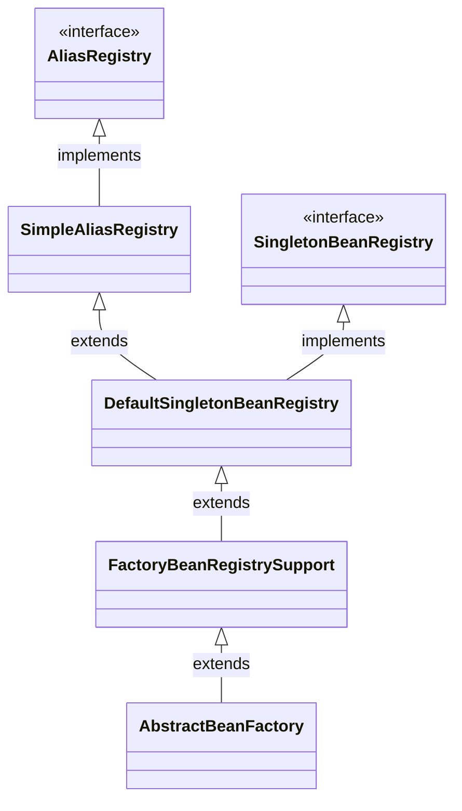
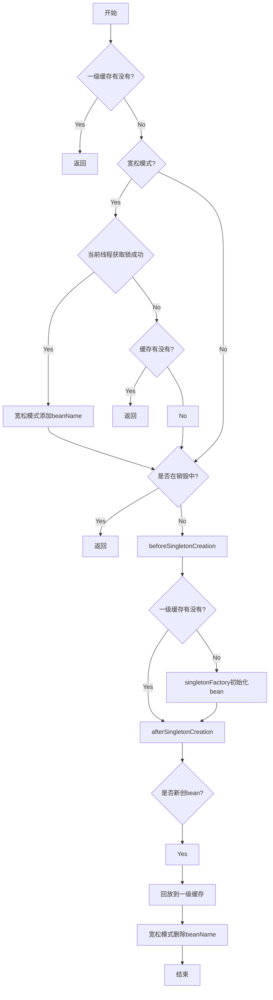
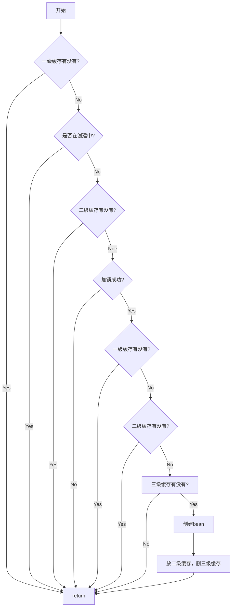

# DefaultSingletonBeanRegistry

# 1. 继承关系


DefaultSingletonBeanRegistry 本质上是bean仓库,不负责创建销毁的过程

# 2.增删改查
全程围绕着几    个属性
```
    /** Cache of singleton objects: bean name to bean instance. */
    private final Map<String, Object> singletonObjects = new ConcurrentHashMap<>(256);

	/** Creation-time registry of singleton factories: bean name to ObjectFactory. */
	private final Map<String, ObjectFactory<?>> singletonFactories = new ConcurrentHashMap<>(16);

	/** Cache of early singleton objects: bean name to bean instance. */
	private final Map<String, Object> earlySingletonObjects = new ConcurrentHashMap<>(16);

	/** Set of registered singletons, containing the bean names in registration order. */
	private final Set<String> registeredSingletons = Collections.synchronizedSet(new LinkedHashSet<>(256));
```

## 2.1 bean 添加
```java
    // 线程安全的 addSingleton
    @Override
	public void registerSingleton(String beanName, Object singletonObject) throws IllegalStateException {
		Assert.notNull(beanName, "Bean name must not be null");
		Assert.notNull(singletonObject, "Singleton object must not be null");
		this.singletonLock.lock();
		try {
			addSingleton(beanName, singletonObject);
		}
		finally {
			this.singletonLock.unlock();
		}
	}

protected void addSingleton(String beanName, Object singletonObject) {
		Object oldObject = this.singletonObjects.putIfAbsent(beanName, singletonObject);
		if (oldObject != null) {
			throw new IllegalStateException("Could not register object [" + singletonObject +
					"] under bean name '" + beanName + "': there is already object [" + oldObject + "] bound");
		}
		this.singletonFactories.remove(beanName);
		this.earlySingletonObjects.remove(beanName);
		this.registeredSingletons.add(beanName);

		Consumer<Object> callback = this.singletonCallbacks.get(beanName);
		if (callback != null) {
			callback.accept(singletonObject);
		}
	}
```
## 2.2 bean 删除
```java
protected void removeSingleton(String beanName) {
		this.singletonObjects.remove(beanName);
		this.singletonFactories.remove(beanName);
		this.earlySingletonObjects.remove(beanName);
		this.registeredSingletons.remove(beanName);
	}

```
## 2.3 核心方法 getSingleton(String beanName, ObjectFactory<?> singletonFactory)
```java
public Object getSingleton(String beanName, ObjectFactory<?> singletonFactory)

// 添加到 Set<String> singletonsCurrentlyInCreation 
protected void beforeSingletonCreation(String beanName) {
		if (!this.inCreationCheckExclusions.contains(beanName) && !this.singletonsCurrentlyInCreation.add(beanName)) {
			throw new BeanCurrentlyInCreationException(beanName);
		}
	}

术语：
一级缓存：singletonObjects
二级缓存：earlySingletonObjects
三级缓存：singletonFactories
宽松模式:
1.isCurrentThreadAllowedToHoldSingletonLock 子类返回 true
2.this.singletonLock.tryLock() 失败

```


总结：
1. 该方法的操作对象是一级缓存

## 2.4 核心方法 getSingleton(String beanName, boolean allowEarlyReference) 
术语：
- 一级缓存：singletonObjects
- 二级缓存：earlySingletonObjects
- 三级缓存：singletonFactories


总结：
1. 这个方法与1，2，3级缓存均有交互