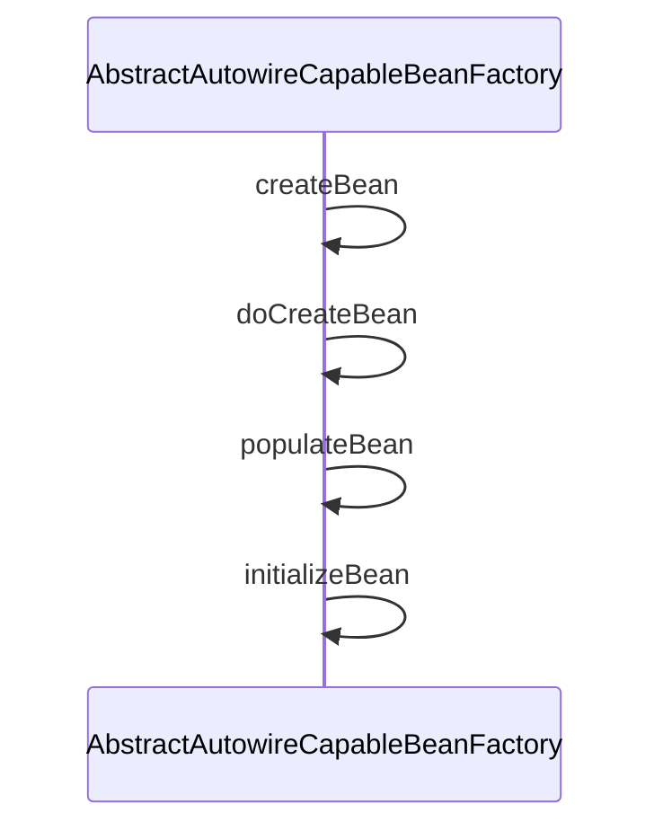
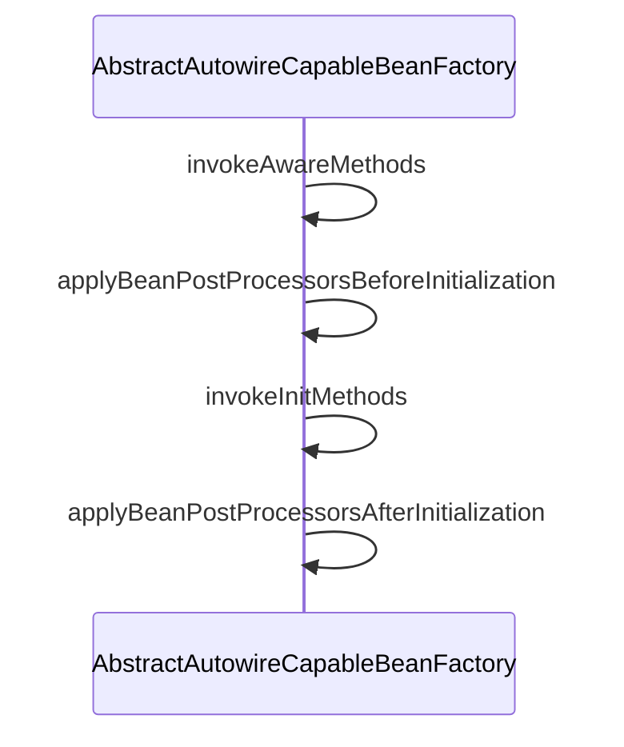
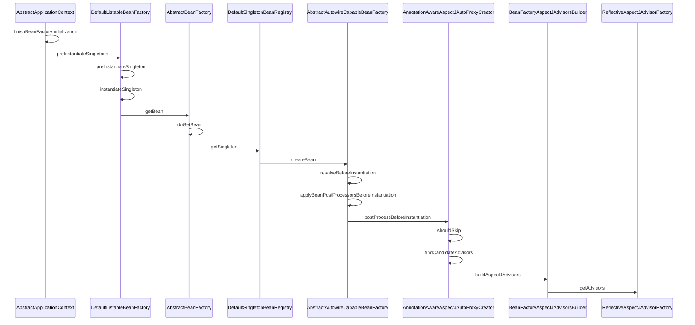

# AOP机制

# 1. 代理机制
spring-aop 使用的两种代理机制
1. JDK同态代理(JDK dynamic proxies)
2. CGLIB

一句话总结核心区别：JDK 动态代理基于“接口”实现（兄弟关系），CGLIB 基于“继承”实现（父子关系）。

## 1.1 技术实现机制（底层原理）
|  对比维度	| JDK 动态代理	|CGLIB 动态代理 |
| --- | --- |  ---|
|核心类库	 |Java 原生自带（java.lang.reflect.Proxy） |	第三方字节码库（Spring 已将其打包在 spring-core 中） |
|生成逻辑	 |实现目标对象相同的接口，生成一个实现了该接口的匿名类。 |	创建目标对象的子类，通过 ASM 字节码技术重写父类的方法。 |
|方法调用方式	 |通过反射（Method.invoke()）调用目标方法。	 |通过直接调用（super.method()）或 FastClass 机制（避免反射），性能更高。 |
|核心接口/类	 |InvocationHandler + Proxy.newProxyInstance() |	Enhancer + MethodInterceptor |

## 1.2. 各自的硬性限制（容易踩的坑）
### 1.2.1 JDK 动态代理的限制

必须实现接口：目标类必须至少实现一个接口，否则无法代理。

只能代理接口中的方法：目标类中自己定义的、不属于任何接口的方法，无法被拦截增强。

### 1.2.2 CGLIB 的限制

无法代理 final 类：因为 final 类不能被继承。

无法增强 final 和 private 方法：子类可以重写 public 和 protected 方法，但无法重写 final 方法，也无法访问父类的 private 方法（这两个方法执行时不会走代理，直接执行原始逻辑）。

无法代理自己调用自己的方法
```java

public class SimplePojo implements Pojo {

	public void foo() {
		this.bar()
	}

	public void bar() {
		// some logic...
	}
}
```
实在不行，需要自己调用自己，就用下面的写法吧
```java

public class SimplePojo implements Pojo {

	public void foo() {
		// This works, but it should be avoided if possible.
		((Pojo) AopContext.currentProxy()).bar();
	}

	public void bar() {
		// some logic...
	}
}

```

需要额外依赖（虽然 Spring 已包含）：本质上是第三方库，但在 Spring 项目中无需额外引入。

## 1.3. 性能对比（创建 vs 运行时）
这是一个经典误区：并非 CGLIB 一定比 JDK 快。

|性能指标|	JDK 动态代理|	CGLIB 动态代理|
| --- | --- | --- |
|代理对象创建速度|	快（生成字节码简单，JVM 内部有优化缓存）|	慢（需要生成复杂的子类字节码，消耗资源）|
|方法调用速度（运行时）|	慢（基于反射调用，JVM 难以内联优化）|	快（基于直接调用或 FastClass 索引，非反射）|
结论：如果创建频繁但调用较少，JDK 更好；如果创建一次且调用极其频繁（如 Service 层高频调用），CGLIB 的运行时优势更明显。但在 JDK 8+ 中，反射性能已大幅提升，实际差距在现代应用中往往可以忽略。

## 1.4 Spring 中的选择逻辑（DefaultAopProxyFactory）
Spring 在决定使用哪种代理时，遵循以下优先级：

如果目标对象实现了至少一个接口 → 默认使用 JDK 动态代理（传统 Spring 默认）。

如果目标对象没有实现任何接口 → 自动切换为 CGLIB。

如果强制开启 CGLIB → 无论是否实现接口，均使用 CGLIB。

重要变更：Spring Boot 2.x 及以上版本，默认将 spring.aop.proxy-target-class 设置为 true，因此 默认使用 CGLIB，而不是传统 Spring 的 JDK 代理。

## 1.5 如何强制指定代理方式
spring-boot 配置文件：
```java
# true 强制 CGLIB（Spring Boot 2.x 默认）；false 强制 JDK
spring.aop.proxy-target-class=true
``` 

Java 配置(非spring-boot)
```java
@Configuration
@EnableAspectJAutoProxy(proxyTargetClass = true) // true=CGLIB, false=JDK
public class AppConfig {}
```

xml配置文件
要强制使用 CGLIB 代理，可将 <aop:config> 元素的 proxy-target-class 属性值设置为 true，如下所示：

```xml
<aop:config proxy-target-class="true">
	<!-- other beans defined here... -->
</aop:config>


```
在使用 @AspectJ 自动代理支持时，若要强制使用 CGLIB 代理，请将 <aop:aspectj-autoproxy> 元素的 proxy-target-class 属性设置为 true，如下所示：
```java
<aop:aspectj-autoproxy proxy-target-class="true"/>
```

# 2. 代码解读

## 2.1 代理的创建

创建代理发生在 initializeBean中的 applyBeanPostProcessorsAfterInitialization 中


```java
// AbstractAutowireCapableBeanFactory.java
public Object applyBeanPostProcessorsAfterInitialization(Object existingBean, String beanName)
			throws BeansException {

		Object result = existingBean;
		for (BeanPostProcessor processor : getBeanPostProcessors()) {
            // processor = AnnotationAwareAspectJAutoProxyCreator
            // 创建代理
			Object current = processor.postProcessAfterInitialization(result, beanName);
			if (current == null) {
				return result;
			}
			result = current;
		}
		return result;
	}

```

```java
// AbstractAutoProxyCreator.java
public Object postProcessAfterInitialization(@Nullable Object bean, String beanName) {
		if (bean != null) {
			Object cacheKey = getCacheKey(bean.getClass(), beanName);
			if (this.earlyBeanReferences.remove(cacheKey) != bean) {
				return wrapIfNecessary(bean, beanName, cacheKey);
			}
		}
		return bean;
}
protected Object wrapIfNecessary(Object bean, String beanName, Object cacheKey) {
		if (StringUtils.hasLength(beanName) && this.targetSourcedBeans.contains(beanName)) {
			return bean;
		}
		if (Boolean.FALSE.equals(this.advisedBeans.get(cacheKey))) {
			return bean;
		}
		if (isInfrastructureClass(bean.getClass()) || shouldSkip(bean.getClass(), beanName)) {
			this.advisedBeans.put(cacheKey, Boolean.FALSE);
			return bean;
		}

		// Create proxy if we have advice.
		Object[] specificInterceptors = getAdvicesAndAdvisorsForBean(bean.getClass(), beanName, null);
		if (specificInterceptors != DO_NOT_PROXY) {
			this.advisedBeans.put(cacheKey, Boolean.TRUE);
			// 创建代理
            Object proxy = createProxy(
					bean.getClass(), beanName, specificInterceptors, new SingletonTargetSource(bean));
			this.proxyTypes.put(cacheKey, proxy.getClass());
            return proxy;
		}

		this.advisedBeans.put(cacheKey, Boolean.FALSE);
		return bean;
	}


```
## 2.2 Advice的创建

在创建第一个自定义bean的时候，初始化advice缓存



```java
// BeanFactoryAspectJAdvisorsBuilder.java

public List<Advisor> buildAspectJAdvisors() {
		List<String> aspectNames = this.aspectBeanNames;

		if (aspectNames == null) {
			synchronized (this) {
				aspectNames = this.aspectBeanNames;
				if (aspectNames == null) {
					List<Advisor> advisors = new ArrayList<>();
					aspectNames = new ArrayList<>();
					String[] beanNames = BeanFactoryUtils.beanNamesForTypeIncludingAncestors(
							this.beanFactory, Object.class, true, false);
					for (String beanName : beanNames) {
						if (!isEligibleBean(beanName)) {
							continue;
						}
						// We must be careful not to instantiate beans eagerly as in this case they
						// would be cached by the Spring container but would not have been weaved.
						Class<?> beanType = this.beanFactory.getType(beanName, false);
						if (beanType == null) {
							continue;
						}
						if (this.advisorFactory.isAspect(beanType)) {
							try {
								AspectMetadata amd = new AspectMetadata(beanType, beanName);
								if (amd.getAjType().getPerClause().getKind() == PerClauseKind.SINGLETON) {
									MetadataAwareAspectInstanceFactory factory =
											new BeanFactoryAspectInstanceFactory(this.beanFactory, beanName);
									List<Advisor> classAdvisors = this.advisorFactory.getAdvisors(factory);
									if (this.beanFactory.isSingleton(beanName)) {
										this.advisorsCache.put(beanName, classAdvisors);
									}
									else {
										this.aspectFactoryCache.put(beanName, factory);
									}
									advisors.addAll(classAdvisors);
								}
								else {
									// Per target or per this.
									if (this.beanFactory.isSingleton(beanName)) {
										throw new IllegalArgumentException("Bean with name '" + beanName +
												"' is a singleton, but aspect instantiation model is not singleton");
									}
									MetadataAwareAspectInstanceFactory factory =
											new PrototypeAspectInstanceFactory(this.beanFactory, beanName);
									this.aspectFactoryCache.put(beanName, factory);
									advisors.addAll(this.advisorFactory.getAdvisors(factory));
								}
								aspectNames.add(beanName);
							}
							catch (IllegalArgumentException | IllegalStateException | AopConfigException ex) {
								if (logger.isDebugEnabled()) {
									logger.debug("Ignoring incompatible aspect [" + beanType.getName() + "]: " + ex);
								}
							}
						}
					}
					this.aspectBeanNames = aspectNames;
					return advisors;
				}
			}
		}

		if (aspectNames.isEmpty()) {
			return Collections.emptyList();
		}
		List<Advisor> advisors = new ArrayList<>();
		for (String aspectName : aspectNames) {
			List<Advisor> cachedAdvisors = this.advisorsCache.get(aspectName);
			if (cachedAdvisors != null) {
				advisors.addAll(cachedAdvisors);
			}
			else {
				MetadataAwareAspectInstanceFactory factory = this.aspectFactoryCache.get(aspectName);
				advisors.addAll(this.advisorFactory.getAdvisors(factory));
			}
		}
		return advisors;
	}

```


```java
// ReflectiveAspectJAdvisorFactory.java

public Advisor getAdvisor(Method candidateAdviceMethod, MetadataAwareAspectInstanceFactory aspectInstanceFactory,
			int declarationOrderInAspect, String aspectName) {

		validate(aspectInstanceFactory.getAspectMetadata().getAspectClass());

		AspectJExpressionPointcut expressionPointcut = getPointcut(
				candidateAdviceMethod, aspectInstanceFactory.getAspectMetadata().getAspectClass());
		if (expressionPointcut == null) {
			return null;
		}

		try {
			return new InstantiationModelAwarePointcutAdvisorImpl(expressionPointcut, candidateAdviceMethod,
					this, aspectInstanceFactory, declarationOrderInAspect, aspectName);
		}
		catch (IllegalArgumentException | IllegalStateException ex) {
			if (logger.isDebugEnabled()) {
				logger.debug("Ignoring incompatible advice method: " + candidateAdviceMethod, ex);
			}
			return null;
		}
	}


```

## 2.3 proxy的invoke过程

