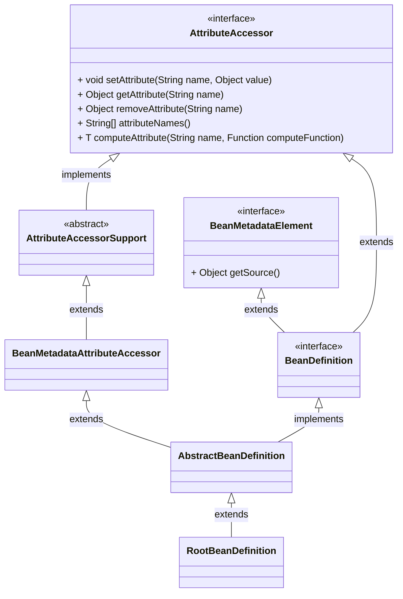

# BeanDefinition

```mermaid
classDiagram
BeanMetadataElement <|-- BeanDefinition:extends
AttributeAccessor <|-- BeanDefinition:extends
AttributeAccessor <|-- AttributeAccessorSupport:implements
AttributeAccessorSupport <|-- BeanMetadataAttributeAccessor:extends
BeanMetadataAttributeAccessor <|-- AbstractBeanDefinition:extends
AbstractBeanDefinition <|-- RootBeanDefinition:extends
BeanDefinition <|-- AbstractBeanDefinition:implements

class BeanMetadataElement {
    <<interface>>
    + Object getSource()
}
class AttributeAccessor {
    <<interface>>
    + void setAttribute(String name, Object value)
    + Object getAttribute(String name)
    + Object removeAttribute(String name)
    + String[] attributeNames()
    + T computeAttribute(String name, Function computeFunction)
}
class BeanDefinition {
     <<interface>>
}
class AttributeAccessorSupport {
    <<abstract>>
}

```