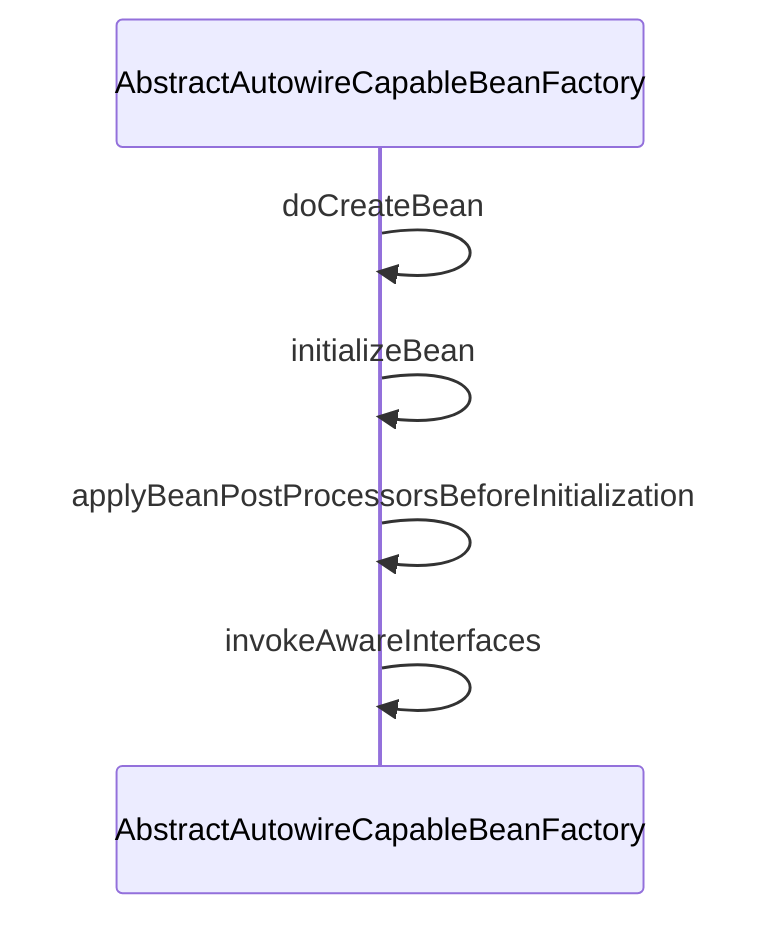
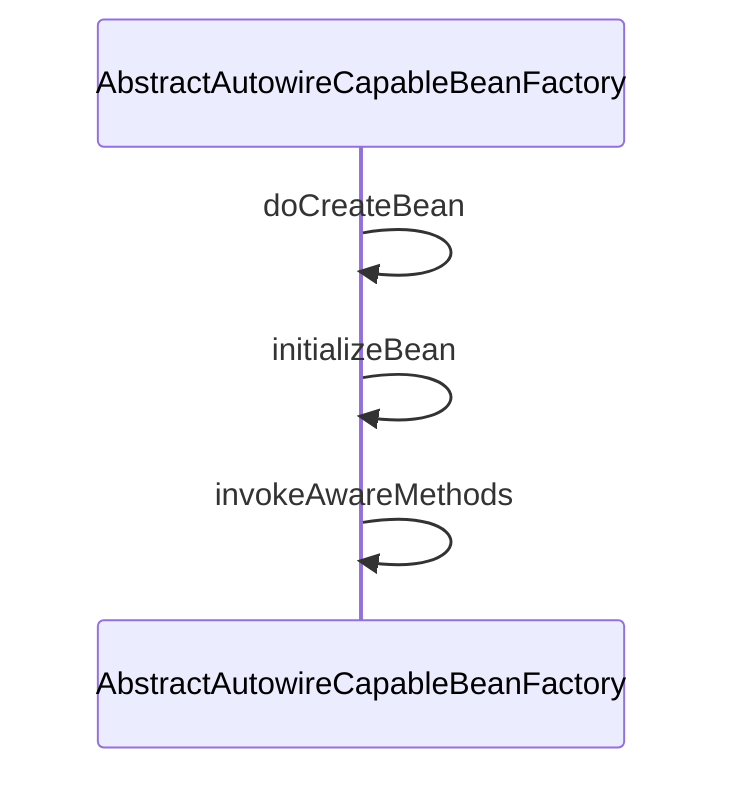

# Aware

# 1.Aware是什么？
表示某个bean有资格通过回调式方法由Spring容器就特定框架对象进行通知。实际的方法签名由各个子接口决定，但通常应仅包含一个返回void的方法，该方法接受一个参数。

# 2.常见的aware有哪些
- ApplicationContextAware
- EnvironmentAware
- EmbeddedValueResolverAware
- ResourceLoaderAware
- ApplicationEventPublisherAware
- MessageSourceAware
- ApplicationStartupAware


# 3. ApplicationContextAware
任何希望获知其运行于哪个 ApplicationContext 的对象都应实现此接口。 
实现此接口是有意义的，例如当某个对象需要访问一组协作的 Bean 时。请注意，通过 Bean 引用进行配置，比仅仅为了查找 Bean 而实现此接口更为可取。 
如果某个对象需要访问文件资源（例如希望调用 getResource 方法、发布应用事件或需要访问 MessageSource），也可以实现此接口。不过，在此类特定场景中，更推荐实现更具体的 ResourceLoaderAware、ApplicationEventPublisherAware 或 MessageSourceAware 接口。 
请注意，文件资源依赖也可以通过类型为 org.springframework.core.io.Resource 的 Bean 属性来暴露，这些属性可以通过字符串形式由 BeanFactory 自动进行类型转换并填充。这样就不需要仅仅为了访问特定文件资源而实现任何回调接口。

用一句话概括：能让bean知道当前的 ApplicationContext 是什么?

```java

public interface ApplicationContextAware extends Aware {

	void setApplicationContext(ApplicationContext applicationContext) throws BeansException;

}
```

调用栈如下:


源代码如下
```java
private void invokeAwareInterfaces(Object bean) {
		if (bean instanceof EnvironmentAware environmentAware) {
			environmentAware.setEnvironment(this.applicationContext.getEnvironment());
		}
		if (bean instanceof EmbeddedValueResolverAware embeddedValueResolverAware) {
			embeddedValueResolverAware.setEmbeddedValueResolver(this.embeddedValueResolver);
		}
		if (bean instanceof ResourceLoaderAware resourceLoaderAware) {
			resourceLoaderAware.setResourceLoader(this.applicationContext);
		}
		if (bean instanceof ApplicationEventPublisherAware applicationEventPublisherAware) {
			applicationEventPublisherAware.setApplicationEventPublisher(this.applicationContext);
		}
		if (bean instanceof MessageSourceAware messageSourceAware) {
			messageSourceAware.setMessageSource(this.applicationContext);
		}
		if (bean instanceof ApplicationStartupAware applicationStartupAware) {
			applicationStartupAware.setApplicationStartup(this.applicationContext.getApplicationStartup());
		}
		if (bean instanceof ApplicationContextAware applicationContextAware) {
			applicationContextAware.setApplicationContext(this.applicationContext);
		}
	}
```
**回调发生在bean创建之后,自定义init函数之前**

相同的步骤如下
- ApplicationContextAware
- EnvironmentAware
- EmbeddedValueResolverAware
- ResourceLoaderAware
- ApplicationEventPublisherAware
- MessageSourceAware
- ApplicationStartupAware

# 4. BeanNameAware

需要实现该接口的 bean 是那些希望在 bean 工厂中了解自身 bean 名称的 bean。请注意，通常不建议对象依赖于其 bean 名称，因为这可能代表对外部配置的脆弱依赖，也可能是不必要地依赖 Spring API。

简单的说：让bean知道自己的名字

```java
public interface BeanNameAware extends Aware {

	/**
	 * Set the name of the bean in the bean factory that created this bean.
	 * <p>Invoked after population of normal bean properties but before an
	 * init callback such as {@link InitializingBean#afterPropertiesSet()}
	 * or a custom init-method.
	 * @param name the name of the bean in the factory.
	 * Note that this name is the actual bean name used in the factory, which may
	 * differ from the originally specified name: in particular for inner bean
	 * names, the actual bean name might have been made unique through appending
	 * "#..." suffixes. Use the {@link BeanFactoryUtils#originalBeanName(String)}
	 * method to extract the original bean name (without suffix), if desired.
	 */
	void setBeanName(String name);

}
```

调用栈如下:

**发生在invokeAwareInterfaces之前**

```java

	protected Object initializeBean(String beanName, Object bean, @Nullable RootBeanDefinition mbd) {
		// BeanNameAware,BeanClassLoaderAware,BeanFactoryAware
        invokeAwareMethods(beanName, bean);

		Object wrappedBean = bean;
		if (mbd == null || !mbd.isSynthetic()) {
            // ApplicationContextAware 等 第3节的Aware
			wrappedBean = applyBeanPostProcessorsBeforeInitialization(wrappedBean, beanName);
		}

		try {
            // 自定义初始化函数
			invokeInitMethods(beanName, wrappedBean, mbd);
		}
		catch (Throwable ex) {
			throw new BeanCreationException(
					(mbd != null ? mbd.getResourceDescription() : null), beanName, ex.getMessage(), ex);
		}
		if (mbd == null || !mbd.isSynthetic()) {
			wrappedBean = applyBeanPostProcessorsAfterInitialization(wrappedBean, beanName);
		}

		return wrappedBean;
	}

    	private void invokeAwareMethods(String beanName, Object bean) {
		if (bean instanceof Aware) {
			if (bean instanceof BeanNameAware beanNameAware) {
				beanNameAware.setBeanName(beanName);
			}
			if (bean instanceof BeanClassLoaderAware beanClassLoaderAware) {
				ClassLoader bcl = getBeanClassLoader();
				if (bcl != null) {
					beanClassLoaderAware.setBeanClassLoader(bcl);
				}
			}
			if (bean instanceof BeanFactoryAware beanFactoryAware) {
				beanFactoryAware.setBeanFactory(AbstractAutowireCapableBeanFactory.this);
			}
		}
	}
```
相同的步骤如下
- BeanNameAware
- BeanClassLoaderAware
- BeanFactoryAware


# 5.总结 
aware接口就是一个通知，为了让一个bean知道所处的context上下文
aware回调均发生在bean属性填充后(populateBean)步骤之后，自定义init函数回调之前
BeanNameAware,BeanClassLoaderAware,BeanFactoryAware 这三个Aaware接口的优先级最高

