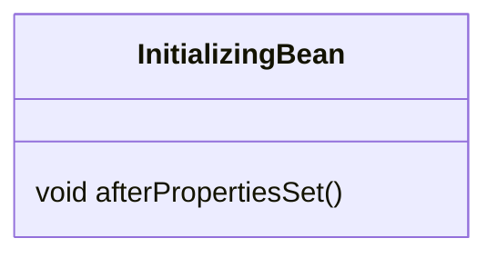
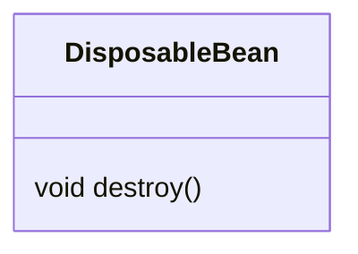
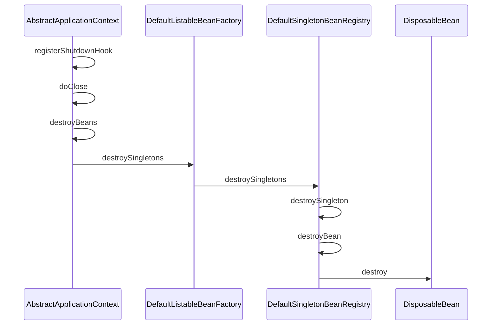

# bean Lifecycle

先来看看bean创建的几个关键步骤(AbstractAutowireCapableBeanFactory)

1. doCreateBean:入口
2. createBeanInstance：创建实例
3. populateBean:填充属性
4. initializeBean：回调接口
5. destroyBean:销毁bean

bean生命周期的几个关键回调
- org.springframework.beans.factory.InitializingBean 
- org.springframework.beans.factory.DisposableBean
- @PostConstruct
- @PreDestroy


# 1. InitializingBean
属性填充后回调


堆栈如下
```
AbstractAutowireCapableBeanFactory.initializeBean
AbstractAutowireCapableBeanFactory.invokeInitMethods
```
# 2. DisposableBean
bean销毁的时候回调,注意需要手动注册context的shutdownhook

```java
context.registerShutdownHook();
```
类图如下

调用栈如下:

# 3. @PostConstruct
这个与InitializingBean类似，也是属性设置完了回调，区别在于这个只是一个注解
堆栈如下
```
AbstractAutowireCapableBeanFactory.initializeBean
AbstractAutowireCapableBeanFactory.applyBeanPostProcessorsBeforeInitialization

	protected Object initializeBean(String beanName, Object bean, @Nullable RootBeanDefinition mbd) {
		invokeAwareMethods(beanName, bean);

		Object wrappedBean = bean;
		if (mbd == null || !mbd.isSynthetic()) {
			wrappedBean = applyBeanPostProcessorsBeforeInitialization(wrappedBean, beanName);
		}

		try {
			invokeInitMethods(beanName, wrappedBean, mbd);
		}
		catch (Throwable ex) {
			throw new BeanCreationException(
					(mbd != null ? mbd.getResourceDescription() : null), beanName, ex.getMessage(), ex);
		}
		if (mbd == null || !mbd.isSynthetic()) {
			wrappedBean = applyBeanPostProcessorsAfterInitialization(wrappedBean, beanName);
		}

		return wrappedBean;
	}

```
发生在 initializeBean 之前

# 4.@PreDestroy

与DisposableBean类似的功能，在bean销毁前回调

堆栈如下

发生在DisposableBean之前
```java
@Override
	public void destroy() {
		if (!CollectionUtils.isEmpty(this.beanPostProcessors)) {
			for (DestructionAwareBeanPostProcessor processor : this.beanPostProcessors) {
                // 回调 @PreDestroy
				processor.postProcessBeforeDestruction(this.bean, this.beanName);
			}
		}

		if (this.invokeDisposableBean) {
			if (logger.isTraceEnabled()) {
				logger.trace("Invoking destroy() on bean with name '" + this.beanName + "'");
			}
			try {
                // 回调DisposableBean
				((DisposableBean) this.bean).destroy();
			}
			catch (Throwable ex) {
				if (logger.isWarnEnabled()) {
					String msg = "Invocation of destroy method failed on bean with name '" + this.beanName + "'";
					if (logger.isDebugEnabled()) {
						// Log at warn level like below but add the exception stacktrace only with debug level
						logger.warn(msg, ex);
					}
					else {
						logger.warn(msg + ": " + ex);
					}
				}
			}
		}
        // 自定义销毁函数
		...
	}

```
# 5.总结
本文总结了4种bean生命周期回调函数，他们的回调顺序如下
- @PostConstruct
- InitializingBean.afterPropertiesSet
- @PreDestroy
- DisposableBean.destroy