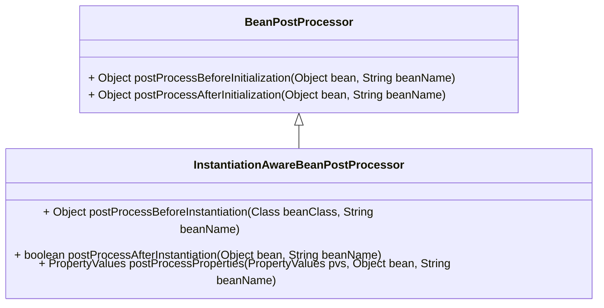

# InstantiationAwareBeanPostProcessor

bean生命周期中的回调接口，提供自定义bean的创建与属性化

几个重要的生命周期函数,初始化的顺序如下
1. postProcessBeforeInstantiation
2. postProcessAfterInstantiation
3. postProcessProperties
4. postProcessBeforeInitialization
5. postProcessAfterInitialization

# 0.类继承关系


# 1. 他们与lifecycle的顺序如何
- postProcessBeforeInstantiation
- postProcessAfterInstantiation
- postProcessProperties
- postProcessBeforeInitialization
- @PostConstruct
- afterPropertiesSet
- postProcessAfterInitialization
- @PreDestroy
- destroy

# 2.调用堆栈如下

```
AbstractAutowireCapableBeanFactory.createBean
    AbstractAutowireCapableBeanFactory.resolveBeforeInstantiation
        AbstractAutowireCapableBeanFactory.applyBeanPostProcessorsBeforeInstantiation
            postProcessBeforeInstantiation
    AbstractAutowireCapableBeanFactory.doCreateBean
    AbstractAutowireCapableBeanFactory.populateBean
        postProcessAfterInstantiation
        postProcessProperties
    AbstractAutowireCapableBeanFactory.initializeBean
        AbstractAutowireCapableBeanFactory.applyBeanPostProcessorsBeforeInitialization
            postProcessBeforeInitialization
            @PostConstruct
        AbstractAutowireCapableBeanFactory.invokeInitMethods
            afterPropertiesSet
        AbstractAutowireCapableBeanFactory.applyBeanPostProcessorsAfterInitialization
            postProcessAfterInitialization
        


```