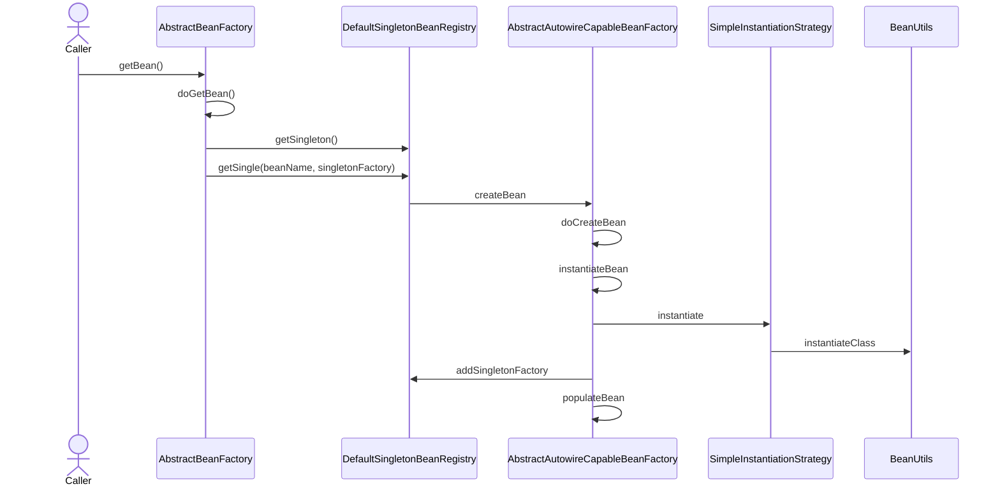

# 简单bean是如何创建的

```mermaid
sequenceDiagram
    actor Caller
    Caller ->> AbstractBeanFactory:getBean()
    AbstractBeanFactory ->>AbstractBeanFactory:doGetBean()
    AbstractBeanFactory ->>DefaultSingletonBeanRegistry:getSingleton()
    AbstractBeanFactory ->>DefaultSingletonBeanRegistry:getSingle(beanName, singletonFactory)
    DefaultSingletonBeanRegistry ->> AbstractAutowireCapableBeanFactory:createBean
    AbstractAutowireCapableBeanFactory ->>AbstractAutowireCapableBeanFactory:doCreateBean
    AbstractAutowireCapableBeanFactory ->>AbstractAutowireCapableBeanFactory:instantiateBean
    AbstractAutowireCapableBeanFactory ->> SimpleInstantiationStrategy:instantiate
    SimpleInstantiationStrategy ->>BeanUtils:instantiateClass
    AbstractAutowireCapableBeanFactory ->>DefaultSingletonBeanRegistry:addSingletonFactory
    AbstractAutowireCapableBeanFactory ->>AbstractAutowireCapableBeanFactory:populateBean

```