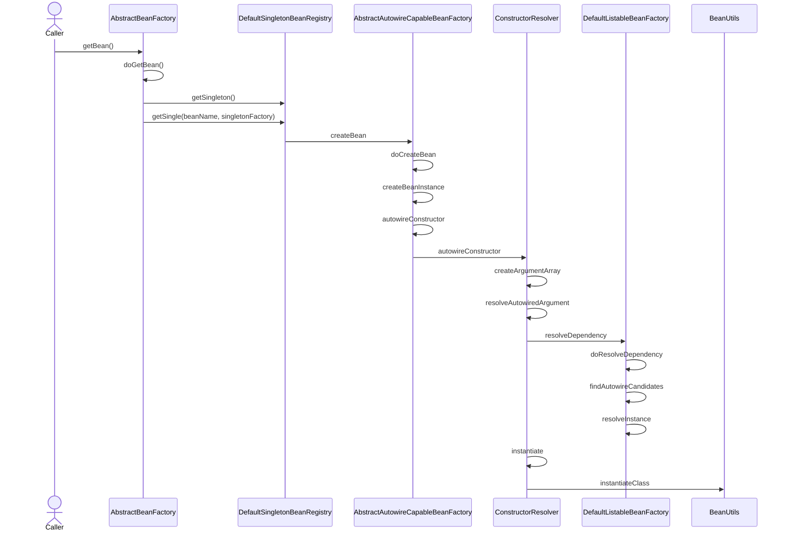

# 简单的构造函数注入

```mermaid
sequenceDiagram
    actor Caller
    Caller ->> AbstractBeanFactory:getBean()
    AbstractBeanFactory ->>AbstractBeanFactory:doGetBean()
    AbstractBeanFactory ->>DefaultSingletonBeanRegistry:getSingleton()
    AbstractBeanFactory ->>DefaultSingletonBeanRegistry:getSingle(beanName, singletonFactory)
    DefaultSingletonBeanRegistry ->> AbstractAutowireCapableBeanFactory:createBean
    AbstractAutowireCapableBeanFactory ->> AbstractAutowireCapableBeanFactory:doCreateBean
    AbstractAutowireCapableBeanFactory ->> AbstractAutowireCapableBeanFactory:createBeanInstance
    AbstractAutowireCapableBeanFactory ->> AbstractAutowireCapableBeanFactory:autowireConstructor
    AbstractAutowireCapableBeanFactory ->> ConstructorResolver:autowireConstructor
    ConstructorResolver ->> ConstructorResolver:createArgumentArray
    ConstructorResolver ->> ConstructorResolver:resolveAutowiredArgument
    ConstructorResolver ->> DefaultListableBeanFactory:resolveDependency
    DefaultListableBeanFactory ->>DefaultListableBeanFactory:doResolveDependency
    DefaultListableBeanFactory ->>DefaultListableBeanFactory:findAutowireCandidates
    DefaultListableBeanFactory ->>DefaultListableBeanFactory:resolveInstance
    ConstructorResolver ->> ConstructorResolver:instantiate
    ConstructorResolver ->> BeanUtils:instantiateClass
```