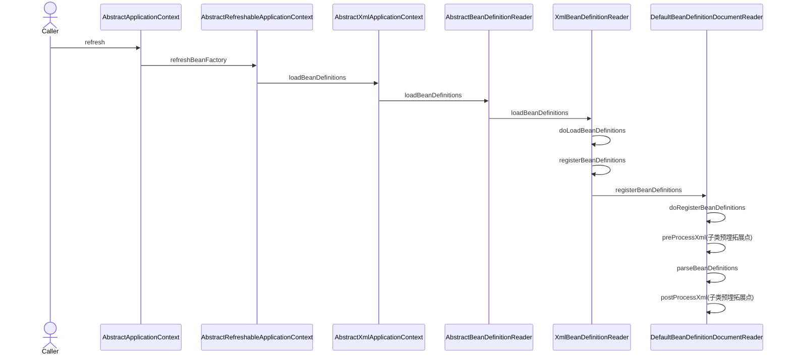
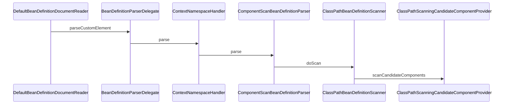

# xml 读取 bean定义(bean definition)
先来回顾一下使用xml定义bean的几种用法

读取xml过程如下


# 1. 使用bean申明一个bean
```
<?xml version="1.0" encoding="UTF-8"?>
<beans xmlns="http://www.springframework.org/schema/beans"
       xmlns:xsi="http://www.w3.org/2001/XMLSchema-instance"
       xsi:schemaLocation="http://www.springframework.org/schema/beans
		https://www.springframework.org/schema/beans/spring-beans.xsd">

    <bean id="petStore" class="cc.alking.example.springboot.beans.PetStore">
    </bean>
</beans>
```


## 1.1 parseBeanDefinitions
```java

protected void parseBeanDefinitions(Element root, BeanDefinitionParserDelegate delegate) {
		if (delegate.isDefaultNamespace(root)) {
            // 只有namespace = http://www.springframework.org/schema/beans
			NodeList nl = root.getChildNodes();
			for (int i = 0; i < nl.getLength(); i++) {
				Node node = nl.item(i);
				if (node instanceof Element ele) {
					if (delegate.isDefaultNamespace(ele)) {
                        // 走到这里
						parseDefaultElement(ele, delegate);
					}
					else {
						delegate.parseCustomElement(ele);
					}
				}
			}
		}
		else {
			delegate.parseCustomElement(root);
		}
	}
```
## 1.2 parseDefaultElement
```
private void parseDefaultElement(Element ele, BeanDefinitionParserDelegate delegate) {
		if (delegate.nodeNameEquals(ele, IMPORT_ELEMENT)) { // import
			importBeanDefinitionResource(ele);
		}
		else if (delegate.nodeNameEquals(ele, ALIAS_ELEMENT)) { //alias
			processAliasRegistration(ele);
		}
		else if (delegate.nodeNameEquals(ele, BEAN_ELEMENT)) {// bean
			processBeanDefinition(ele, delegate);
		}
		else if (delegate.nodeNameEquals(ele, NESTED_BEANS_ELEMENT)) { //beans
			// recurse
			doRegisterBeanDefinitions(ele);
		}
	}
```

关键知识点：namespace

# 2. 使用context:component-scan 扫描一个package
```
<?xml version="1.0" encoding="UTF-8"?>
<beans xmlns="http://www.springframework.org/schema/beans"
       xmlns:xsi="http://www.w3.org/2001/XMLSchema-instance"
       xmlns:context="http://www.springframework.org/schema/context"
       xsi:schemaLocation="http://www.springframework.org/schema/beans
		https://www.springframework.org/schema/beans/spring-beans.xsd
		http://www.springframework.org/schema/context
		https://www.springframework.org/schema/context/spring-context.xsd">

    <context:component-scan base-package="cc.alking.example.springboot.beans"/>

</beans>
```
## 2.1 parseBeanDefinitions
```java
protected void parseBeanDefinitions(Element root, BeanDefinitionParserDelegate delegate) {
		if (delegate.isDefaultNamespace(root)) {
            // 只有namespace = http://www.springframework.org/schema/beans
			NodeList nl = root.getChildNodes();
			for (int i = 0; i < nl.getLength(); i++) {
				Node node = nl.item(i);
				if (node instanceof Element ele) {
                    
					if (delegate.isDefaultNamespace(ele)) {
						parseDefaultElement(ele, delegate);
					}
					else {
                         // namespace = http://www.springframework.org/schema/context
                         // 走到这里
						delegate.parseCustomElement(ele);
					}
				}
			}
		}
		else {
			delegate.parseCustomElement(root);
		}
	}
```



### 2.1.2 NamespaceHandlerSupport.java
```java

    @Override
	@Nullable
	public BeanDefinition parse(Element element, ParserContext parserContext) {
		BeanDefinitionParser parser = findParserForElement(element, parserContext);
		return (parser != null ? parser.parse(element, parserContext) : null);
	}

	private BeanDefinitionParser findParserForElement(Element element, ParserContext parserContext) {
		String localName = parserContext.getDelegate().getLocalName(element);
		// property-override -> PropertyOverrideBeanDefinitionParser
        // annotation-config -> AnnotationConfigBeanDefinitionParser
        // mbean-server -> MBeanServerBeanDefinitionParser
        // component-scan -> ComponentScanBeanDefinitionParser
        // load-time-weaver -> LoadTimeWeaverBeanDefinitionParser
        // property-placeholder -> PropertyPlaceholderBeanDefinitionParser
        // spring-configured -> SpringConfiguredBeanDefinitionParser
        // mbean-export -> MBeanExportBeanDefinitionParser
        BeanDefinitionParser parser = this.parsers.get(localName); // 
		if (parser == null) {
			parserContext.getReaderContext().fatal(
					"Cannot locate BeanDefinitionParser for element [" + localName + "]", element);
		}
		return parser;
	}
```