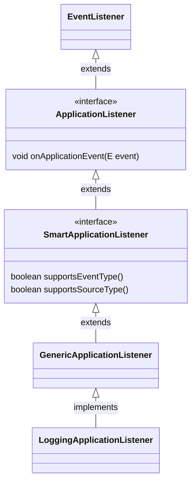

# LoggingApplicationListener

```mermaid
classDiagram
EventListener <|--ApplicationListener:extends
ApplicationListener <|-- SmartApplicationListener:extends
SmartApplicationListener <|-- GenericApplicationListener:extends
GenericApplicationListener <|-- LoggingApplicationListener:implements

class ApplicationListener {
    <<interface>>
  void onApplicationEvent(E event)
}

class SmartApplicationListener {
    <<interface>>
    boolean supportsEventType()
    boolean supportsSourceType()
}

```