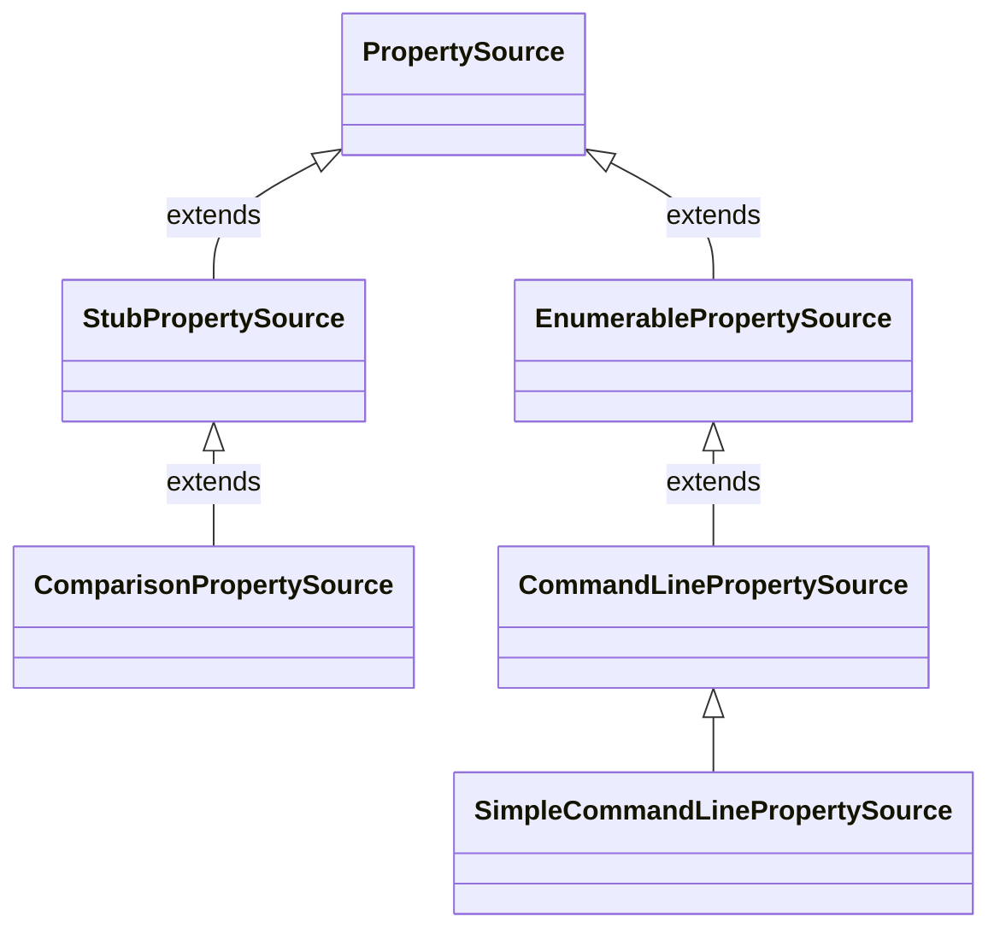

# SimpleCommandLinePropertySource

```mermaid
classDiagram
PropertySource <|--StubPropertySource:extends
StubPropertySource <|-- ComparisonPropertySource:extends
PropertySource <|-- EnumerablePropertySource:extends
EnumerablePropertySource <|-- CommandLinePropertySource:extends
CommandLinePropertySource <|--SimpleCommandLinePropertySource

class PropertySource {
  
}


```